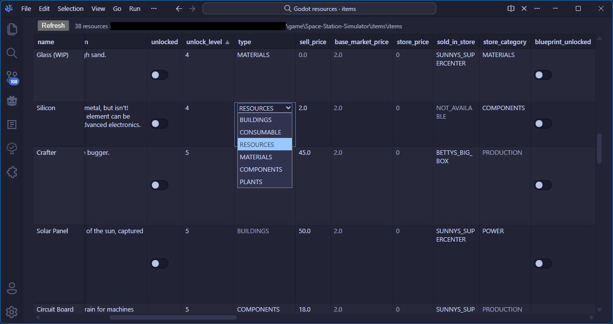
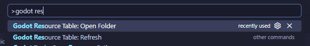

# Godot Resource Table (VS Code extension)


Spreadsheet-style view for editing many Godot 4 `.tres` files in a folder: sortable columns, resizable headers, and in-place edits for simple primitive fields (`bool`, `int`, `float`, `string`). `ExtResource`, arrays, and other complex values are shown read-only.



This work was inspired by don-tnowe's godot plugin [Godot Resources as Sheets](https://github.com/don-tnowe/godot-resources-as-sheets-plugin), use theirs for an integrated solution within the godot editor (it also has way more features!).

WARNING: This was fully built with AI, use at your own risk.

## Requirements

- VScode based editors (Vscodium and cursor also work)

## Download

- [Visual Studio Marketplace](https://marketplace.visualstudio.com/items?itemName=RickyRicardo.godot-resource-table) — install from VS Code or Cursor.
- [Open VSX Registry](https://open-vsx.org/extension/RickyRicardo/godot-resource-table) — for VSCodium and other Open VSX–compatible editors.

## Usage

1. Run via the command palette (screenshot below).
   
2. **Godot Resource Table: Open Folder** — pick a directory; all `*.tres` files under it are loaded recursively.
3. Click a column header to sort (toggle direction on repeat click). Drag the right edge of a header to resize; widths are remembered per folder in workspace state.
4. Double-click an editable cell (or focus it and press **Enter**), edit, then blur or **Enter** to save. Invalid values show an error and the table reloads.
5. **Refresh** button or **Godot Resource Table: Refresh** reloads from disk. The host watches the folder and refreshes after external changes (debounced; writes from this view are briefly ignored to avoid feedback loops).

Columns **file** and **script_class** are read-only. Other columns are the union of all `[resource]` property keys across files; missing keys appear as empty editable cells (saved as strings unless you use a typed value Godot accepts on that line).

## Development

```bash
cd vscode-godot-resource-table
npm install
npm run compile
npm test
```

Press **F5** in VS Code with this folder open (**Run Extension**). In the Extension Development Host, run **Godot Resource Table: Open Folder** from the Command Palette and choose a folder that contains `.tres` files (for example your game’s `items` tree).

## Package

`npm run package` runs `@vscode/vsce`. **Use Node.js 20 LTS or newer** for this step (Node 18 can throw `ReferenceError: File is not defined` from transitive dependencies).

```bash
npm run package
```

Install the generated `.vsix` with **Extensions: Install from VSIX…**.

## Limitations

- New empty cells default to **string** typing when you first add a property name column value.
- Does not run Godot; validate important edits in the Godot inspector.

## License

MIT
